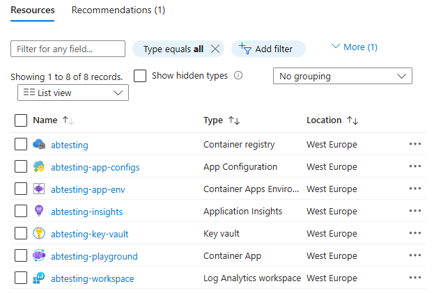
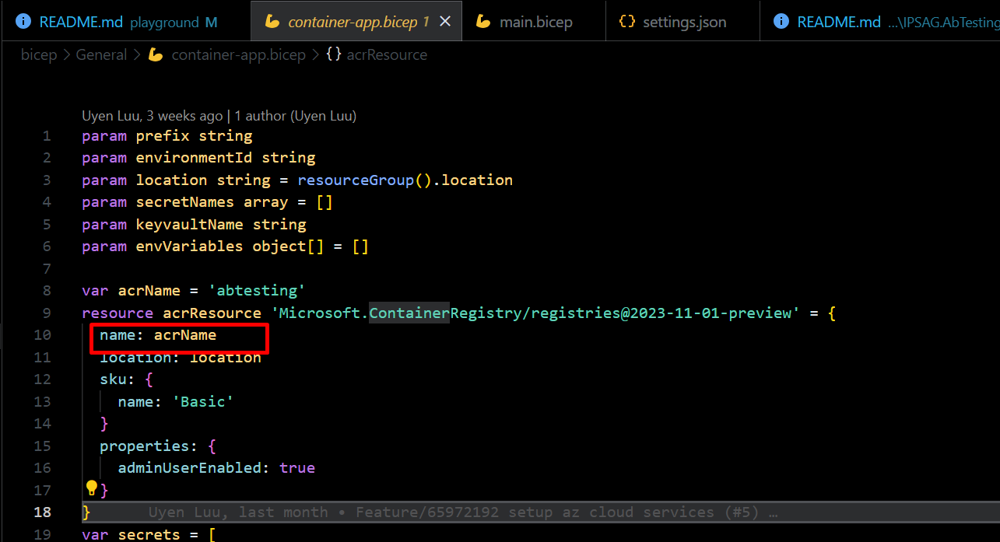

Navigate to the bicep directory and [using Bicep tools][bicep_tools] to run the following commands to create your Azure resources:

```bash
az login
az account set --subscription "<Your subscription name>"
az group create --name rg-abtesting --location westus
az deployment group create --name ab-testing-playground --resource-group rg-abtesting --confirm-with-what-if --template-file main.bicep
```

Wait till the execution finished, these following resources should be created to your Azure subscription



_You may need to rename your Azure Container Registry to ensure that your [ACR name is globally unique][create_acr]_

To do that, open [`bicep/General/container-app.bicep`](../bicep/General/container-app.bicep#L10) and change the ACR name:



[bicep_tools]: https://learn.microsoft.com/en-us/azure/azure-resource-manager/bicep/install
[create_acr]: https://learn.microsoft.com/en-us/azure/aks/cluster-container-registry-integration?tabs=azure-cli#create-a-new-acr