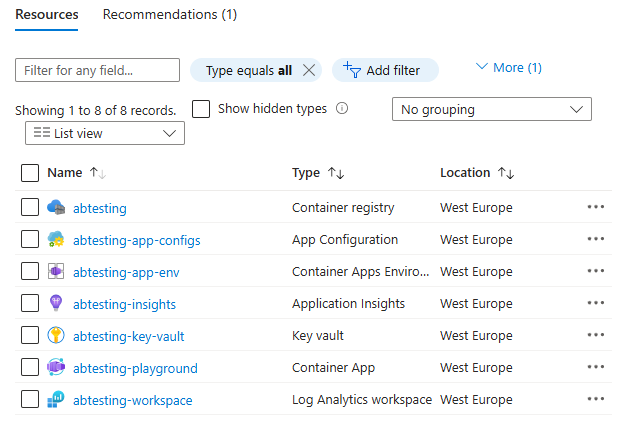
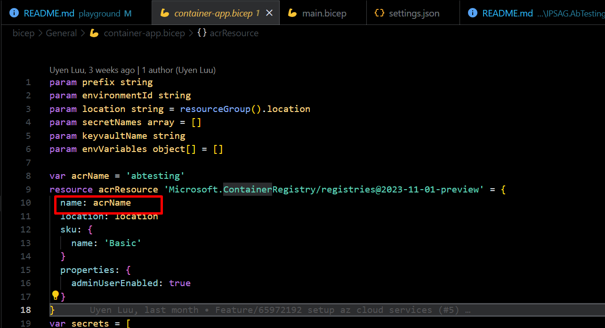

# A/B Testing Playground
[][IPS]
## Introduction

The A/B Testing Playground is a comprehensive suite designed to facilitate A/B testing experiments in a controlled environment. It consists of two main components: an API that serves as the backend, providing endpoints for managing and tracking A/B tests, and a Client application that offers a user-friendly interface for setting up and monitoring these tests. This setup aims to simplify the process of conducting A/B tests, making it accessible to users with varying levels of technical expertise.

### Flow diagram
   
   **Notes**
   - Consumer Application: Your application
      - API: .NET
      - UI: Angular
   - Azure Services: 
      - App Configuration under your Azure subscription
   - Analytics Platforms
      - Google Analytics
      - Microsoft Clarify
   - A/B Testng solution
      - API: using [IPSAG.AbTesting][nuget_package]
      - UI: using [@ips-ag/abtesting][npm_package]
## Getting Started
### Prerequisites
Before you can run this playground, ensure you have the following prerequisites installed on your system:
- [Azure subscription][azure_sub]
- Setup [Google Analytics][google_analytics] and [Find your Google tag ID][google_tag_id]
- Setup [Microsoft Clarify][ms_clarify] and [Find your Locate Project ID][clarify_id]
- **.NET 8.0 or higher SDK Application**: Required to install the Nuget. You can download it from [https://dotnet.microsoft.com/download](https://dotnet.microsoft.com/download).
- **Docker Destop Engine**: 
   * [Install Docker Desktop on Windows][docker_window]
   * [Install Docker Desktop on Linux][docker_linux]

With these prerequisites in place, you're ready to start using the A/B Testing libraries to conduct your A/B testing experiments.

### How to use
To get started with the A/B Testing Playground, follow these steps:

1. **Clone the Repository**: First, clone this repository to your local machine using the following command:

   ```bash  
   git clone https://github.com/ips-ag/demo-ab-testing-azure.git
   ```

2. **Create Azure resources**: 

   In order to run the demo from your local machine, you can manually create an [App Configuration][app_config_docs] and [App Insight][app_insights_docs] (not mandatory) via [Azure portal](https://portal.azure.com/), refer [IPSAG.AbTesting][nuget_package]

   **OR run it on Azure**

   Navigate to the bicep directory and [using Bicep tools][bicep_tools] to run the following commands to create your Azure resources:

   ```bash
   az login
   az account set --subscription "<Your subscription name>"
   az group create --name rg-abtesting --location westus
   az deployment group create --name ab-testing-playground --resource-group rg-abtesting --confirm-with-what-if --template-file main.bicep
   ```
   Wait till the execution finished, these following resources should be created to your Azure subscription
   
    
    *You may need to rename your Azure Container Registry to ensure that your [ACR name is globally unique][create_acr]*

    To do that, open [`bicep/General/container-app.bicep`](../bicep/General/container-app.bicep#L10) and change the ACR name:

    

```
cd API dotnet restore dotnet run
```

3. **Start the Client**: Open a new terminal window, navigate to the client directory, and run the following commands to start the client application:

```
cd CLIENT npm install npm start
```

This will start the client application on `http://localhost:4200`.

## Prerequisites

Before you can run the A/B Testing Playground, ensure you have the following prerequisites installed on your system:

- **.NET 7.0 SDK**: Required to run the API. You can download it from [https://dotnet.microsoft.com/download](https://dotnet.microsoft.com/download).
- **Node.js and npm**: Required to run the client application. Download them from [https://nodejs.org](https://nodejs.org).

With these prerequisites in place, you're ready to start using the A/B Testing Playground to conduct your A/B testing experiments.

## Credits

Many thanks [Rahul Sahay](https://www.udemy.com/user/rahulsahay-2/) for bringing [Building FullStack App using .NetCore, Angular & ChatGPT
](https://www.udemy.com/course/building-fullstack-app-using-netcore-angular-chatgpt/#instructor-1) course to life. If you found the course useful, please consider to buy the course to support him.

## Contributing

We welcome contributions from the community! If you'd like to contribute to the A/B Testing Playground, please follow our contribution guidelines.

## License

The A/B Testing Playground is licensed under the MIT License. Feel free to use, modify, and distribute the code as per the terms of the license.

## Feedback

We value your feedback! If you have any suggestions, bug reports, or feature requests, please open an issue on our GitHub repository.


<!-- LINKS -->
[nuget_source]: https://github.com/ips-ag/demo-ab-testing-azure/tree/main/packages/Nuget/IPSAG.AbTesting
[npm_source]: https://github.com/ips-ag/demo-ab-testing-azure/tree/main/packages/npm/abtesting
[playground_source]: https://github.com/ips-ag/demo-ab-testing-azure/tree/main/playground
[source_readme]: https://github.com/ips-ag/demo-ab-testing-azure/tree/main/packages/Nuget/IPSAG.AbTesting/README.md
[npm_readme]: https://github.com/ips-ag/demo-ab-testing-azure/tree/main/packages/npm/abtesting/README.md
[playground_readme]: https://github.com/ips-ag/demo-ab-testing-azure/tree/main/playground/README.md
[nuget_package]: https://www.nuget.org/packages/IPSAG.AbTesting/
[nuget]: https://www.nuget.org/
[npm_package]: https://www.npmjs.com/package/@ips-ag/abtesting
[playground]: https://github.com/ips-ag/demo-ab-testing-azure/tree/main/playground
[IPS]: https://www.ips-ag.com
[azure_sub]: https://azure.microsoft.com/free/dotnet/
[app_config_docs]: https://learn.microsoft.com/en-us/azure/azure-app-configuration/overview
[app_config_create_portal]: https://learn.microsoft.com/en-us/azure/azure-app-configuration/quickstart-azure-app-configuration-create?tabs=azure-portal
[app_config_create_cli]: https://learn.microsoft.com/en-us/azure/azure-app-configuration/quickstart-azure-app-configuration-create?tabs=azure-cli
[app_insights_docs]: https://learn.microsoft.com/en-us/azure/azure-monitor/app/app-insights-overview
[license]: https://github.com/ips-ag/demo-ab-testing-azure/blob/main/LICENSE
[google_analytics]: https://support.google.com/analytics/answer/9304153?hl=en&amp;ref_topic=14088998&amp;sjid=6531891111814199507-EU
[google_tag_id]: (https://support.google.com/analytics/answer/9539598?hl=en)
[ms_clarify]: https://learn.microsoft.com/en-us/clarity/setup-and-installation/clarity-setup
[clarify_id]: https://learn.microsoft.com/en-us/clarity/third-party-integrations/abtasty-integration#step-1
[docker_window]: https://docs.docker.com/desktop/install/windows-install/
[docker_linux]: https://docs.docker.com/desktop/install/linux-install/
[bicep_tools]: https://learn.microsoft.com/en-us/azure/azure-resource-manager/bicep/install
[create_acr]: https://learn.microsoft.com/en-us/azure/aks/cluster-container-registry-integration?tabs=azure-cli#create-a-new-acr

<style>
    img[alt=logo] { width: 20px; top: 3px; position: relative; margin-right: 5px;}
</style>